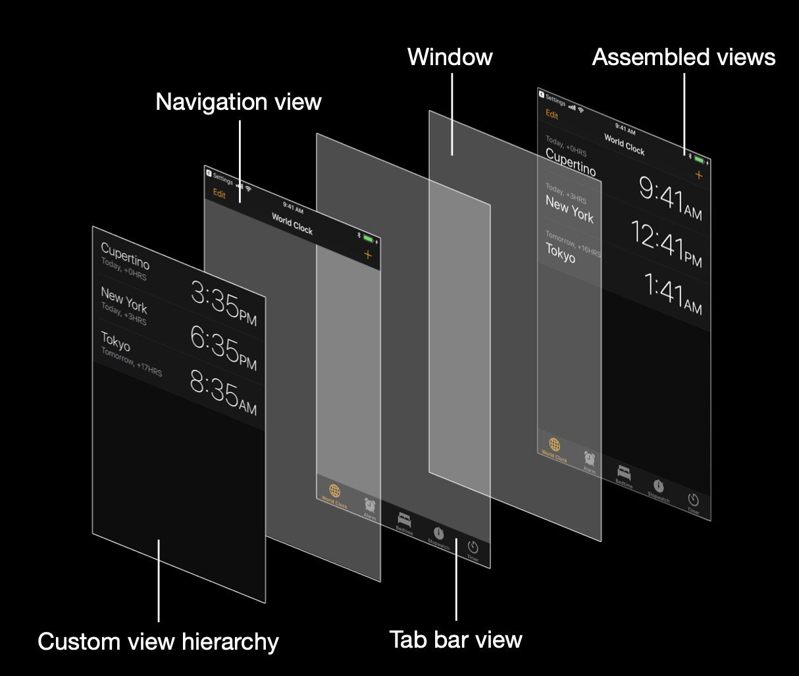
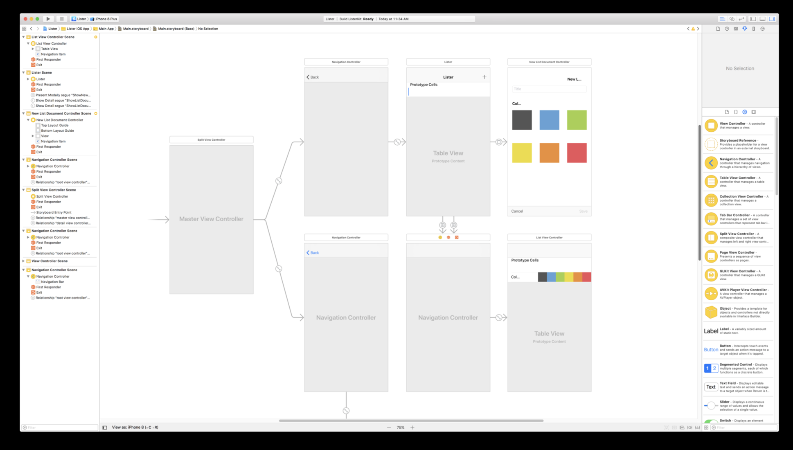

# Interface Builder

## Common Views

## Storyboard

A place where you can design screen layout and how each screen connects to another

### Attribute Inspector
Examples of properties for a label
|Attribute|Property Name|
|:---:|---|
|Text|text|
|Color|textColor|
|Dynamic Type|adjustsFontForContentSizeCategory|
|Font|font|
|Alignment|textAlignment|
|Lines|numberOfLines|
|Enabled|enable|
|Highlighted|isHighlighted|
|Baseline|baselineAdjustment|
|Line Break|lineBreakMode|
|Autoshrink|adjustFontSizeToFitWidth|
|Tighten Letter Spacing|highlightedTextColor|
|Shadow|shadowColor|
|Shadow Offset|shadowOffset|
